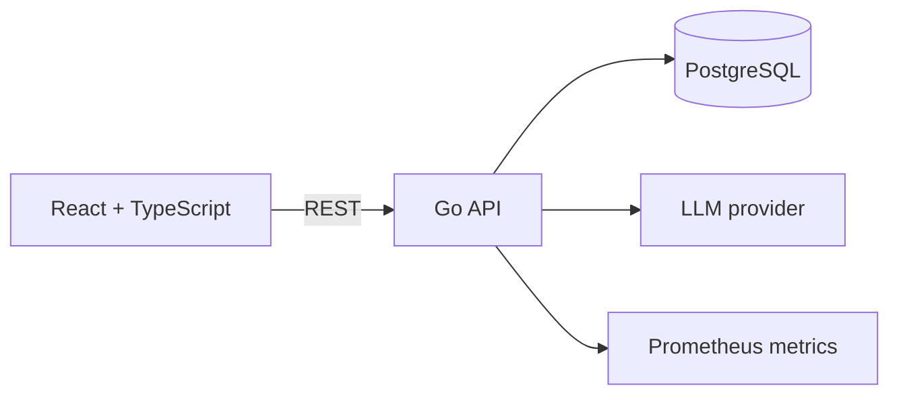

# FactoryOps

A compact manufacturing operations platform for tracking work orders, inventory constraints, and AI-assisted purchase-order extraction.

## Why this project exists

FactoryOps models a real internal manufacturing workflow rather than a generic CRUD dashboard:

1. A planner creates a production work order.
2. The order moves through `PLANNED → IN_PROGRESS → BLOCKED → COMPLETE`.
3. Inventory reservations make component shortages visible.
4. A buyer submits purchase-order text for structured extraction.
5. Extracted fields must be reviewed before they are queued for import.

The hosted portfolio preview works in demo mode. When `NEXT_PUBLIC_API_URL` is configured, the same interface reads and writes through the Go API.

## Stack

- **Backend:** Go 1.23, `net/http`, PostgreSQL, pgx
- **Frontend:** React 19, TypeScript, Vinext
- **Applied AI:** OpenAI-compatible chat-completions API with strict structured output
- **Observability:** Prometheus counters and latency histograms
- **Delivery:** Docker Compose and GitHub Actions

## Architecture



## API surface

| Method | Route | Purpose |
| --- | --- | --- |
| `GET` | `/healthz` | Readiness check |
| `GET` | `/metrics` | Prometheus metrics |
| `GET` | `/api/work-orders` | List production orders |
| `POST` | `/api/work-orders` | Create a production order |
| `PATCH` | `/api/work-orders/{id}/status` | Update workflow status |
| `GET` | `/api/inventory` | List inventory and reservations |
| `POST` | `/api/documents/extract` | Extract purchase-order fields |

## Run locally

Prerequisites: Docker and Node.js 22.

```bash
cp .env.example .env
docker compose up --build
npm install
NEXT_PUBLIC_API_URL=http://localhost:8080 npm run dev
```

The API is available on `http://localhost:8080`. If `LLM_API_KEY` is empty, document extraction uses an explicitly labelled deterministic fallback so the full review workflow remains testable without sending documents to an external provider.

## Tests

```bash
cd backend
go test -race ./...
```

The backend tests cover work-order creation, list behaviour, extraction review requirements, and metrics exposure. GitHub Actions runs backend tests, `go vet`, and the production frontend build on every pull request.

## AI safety choices

- Structured fields are schema-constrained.
- Missing values stay empty; the extraction prompt forbids inventing values.
- The provider and review requirement are returned with every extraction.
- No extracted record is committed without human confirmation.
- The fallback parser is identified as `heuristic-fallback`, not presented as model output.

## Resume bullets

Use only after you understand the implementation well enough to explain it:

- Built a manufacturing operations platform with a Go REST API and React/TypeScript interface for tracking work orders, inventory reservations, and production blockers.
- Implemented PostgreSQL persistence and an OpenAI-compatible structured extraction pipeline for purchase-order data, requiring human verification before import.
- Instrumented API and LLM workflows with Prometheus metrics and added race-tested Go handlers plus automated frontend builds through GitHub Actions.
